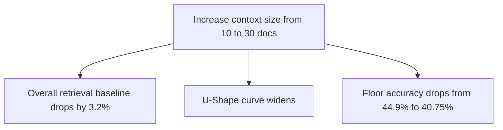

# Lost in the Middle: Llama 3.1:8b Evaluation Report

This report summarizes the performance evaluation of the local `llama3.1:8b` model under the "Lost in the Middle" retrieval task. The evaluation covers three different context sizes (10, 20, and 30 total documents) across all 2,655 questions per position.

> **ℹ️ Note:** **Lost in the Middle Phenomenon:** Large Language Models (LLMs) are often much better at retrieving information from the absolute beginning or the absolute end of their input contexts, but their accuracy degrades significantly when relevant information is placed in the middle.

---

## 1. Executive Summary & Graph Comparison

Below is a sequential visualization of the evaluation graphs generated from the experiments:

### 10-Document Context Evaluation Graph

### 20-Document Context Evaluation Graph

### 30-Document Context Evaluation Graph

### Key Observations:
1. **Clear Performance Degradation:** In all contexts, placing the target information in the middle of the context window degrades accuracy relative to the beginning.
2. **Context Window Stress:** The overall baseline accuracy at Position 0 drops as the context grows longer:
   * **10 Documents:** 49.5% accuracy (Position 0)
   * **20 Documents:** 47.8% accuracy (Position 0)
   * **30 Documents:** 46.3% accuracy (Position 0)
3. **Late Context Recency Bias:** In both the 20-document and 30-document runs, we observe a slight uptick in accuracy at the final position (Position 19 and Position 29 respectively), showing that the model retains recency bias for information presented at the very end of the prompt.

---

## 2. Detailed Performance Tables

### 10-Document Context Configuration
* **Total Run Time:** 4.2 Hours
* **Total Queries:** 7,965 (2,655 questions × 3 positions)

| Gold Position (Index) | Correct Predictions | Total Evaluated | Accuracy (%) |
| :---: | :---: | :---: | :---: |
| **0** (Beginning) | 1,314 | 2,655 | **49.49%** |
| **4** (Middle) | 1,213 | 2,655 | **45.69%** |
| **9** (End) | 1,192 | 2,655 | **44.90%** |

---

### 20-Document Context Configuration
* **Total Run Time:** 13.18 Hours
* **Total Queries:** 13,275 (2,655 questions × 5 positions)

| Gold Position (Index) | Correct Predictions | Total Evaluated | Accuracy (%) |
| :---: | :---: | :---: | :---: |
| **0** (Beginning) | 1,270 | 2,655 | **47.83%** |
| **4** (Early-mid) | 1,124 | 2,655 | **42.34%** |
| **9** (Middle) | 1,122 | 2,655 | **42.26%** |
| **14** (Late-mid) | 1,119 | 2,655 | **42.15%** |
| **19** (End) | 1,136 | 2,655 | **42.79%** |

---

### 30-Document Context Configuration
* **Total Run Time:** 28.4 Hours
* **Total Queries:** 18,585 (2,655 questions × 7 positions)

| Gold Position (Index) | Correct Predictions | Total Evaluated | Accuracy (%) |
| :---: | :---: | :---: | :---: |
| **0** (Beginning) | 1,229 | 2,655 | **46.29%** |
| **4** (5th) | 1,091 | 2,655 | **41.09%** |
| **9** (10th) | 1,102 | 2,655 | **41.51%** |
| **14** (15th) | 1,085 | 2,655 | **40.87%** |
| **19** (20th) | 1,082 | 2,655 | **40.75%** |
| **24** (25th) | 1,082 | 2,655 | **40.75%** |
| **29** (End) | 1,120 | 2,655 | **42.18%** |

---

## 3. Findings & Comparison Analysis

> **💡 Tip:** Comparing all three configurations highlights that context size has a direct, negative correlation with retrieval accuracy. The performance "valley" deepens and widens as context sizes expand.

The data shows that for search and question-answering systems running on `llama3.1:8b`, keeping the number of returned search results as close to **10 documents** as possible is recommended to maintain peak recall accuracy. Passing 30 documents degraded performance across all context slots.
