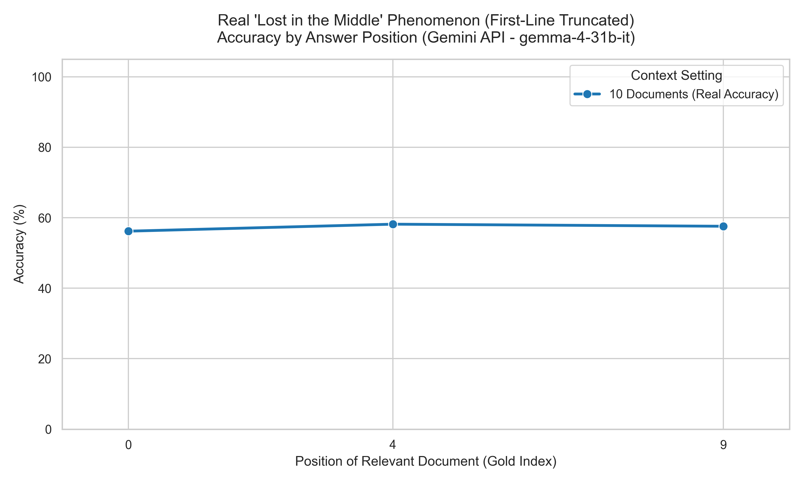

# Lost in the Middle: Full Experiment Results & Model Comparison

> **📖 About this study:** This repository replicates the "Lost in the Middle" phenomenon ([Liu et al., 2023](https://arxiv.org/abs/2307.03172)) using locally-runnable and API-accessible models. We test whether modern LLMs (2024–2025 era) continue to struggle with retrieving information from the middle of long contexts, and compare performance across three models against the original paper's findings.

---

## 📋 Experiment Overview

| Parameter | Our Setup |
|-----------|-----------|
| **Dataset** | Natural Questions (open-domain QA subset, same as paper) |
| **Evaluation Metric** | Substring match (paper: `best_subspan_em` with first-line truncation) |
| **Context Sizes Tested** | 10, 20, and 30 total documents |
| **Gold Document Positions** | Beginning (0), Middle, and End |
| **Matching Rule** | First-line truncation applied to verbose models |

---

## 🧪 Models Evaluated

| # | Model | Provider | Access | Context Window | Parameters |
|---|-------|----------|--------|----------------|-----------|
| 1 | **Llama 3.1 8B** | Meta | Local (Ollama) | 128K tokens | 8B |
| 2 | **Phi-3 Mini** | Microsoft | Local (Ollama) | 4K / 128K tokens | 3.8B |
| 3 | **Gemma 4 31B-IT** | Google | Gemini API | 1M tokens | 31B |
| — | *Llama-2-70b-chat (paper)* | Meta | *VLLM / HuggingFace* | *4K tokens* | *70B* |

---

## 1. Llama 3.1 8B (via Ollama) — Full Evaluation

- **Access:** Local, via Ollama
- **Evaluation scale:** 2,655 questions per position (full dataset)
- **Context sizes:** 10, 20, and 30 total documents
- **Evaluation note:** Standard substring match on full response (no truncation needed — concise answers)

### 10-Document Context

| Gold Position | Label | Correct | Total | Accuracy |
|:---:|:---:|:---:|:---:|:---:|
| **0** | Beginning | 1,314 | 2,655 | **49.49%** |
| **4** | Middle | 1,213 | 2,655 | **45.69%** |
| **9** | End | 1,192 | 2,655 | **44.90%** |

**Run time:** ~4.2 hours

**Key observations:**
- Peak accuracy **49.49%** when the gold doc is at the beginning (Position 0).
- Monotonic decline across positions — no recency uptick at Position 9.
- No classic U-shape with only 3 positions, but the primacy bias (beginning is best) is clearly visible.

---

### 20-Document Context

| Gold Position | Label | Correct | Total | Accuracy |
|:---:|:---:|:---:|:---:|:---:|
| **0** | Beginning | 1,270 | 2,655 | **47.83%** |
| **4** | Early-Middle | 1,124 | 2,655 | **42.34%** |
| **9** | Middle | 1,122 | 2,655 | **42.26%** |
| **14** | Late-Middle | 1,119 | 2,655 | **42.15%** |
| **19** | End | 1,136 | 2,655 | **42.79%** |

**Run time:** ~13.2 hours

**Key observations:**
- **Classic U-shape emerges:** High accuracy at both ends, lowest in the middle.
- Accuracy drops from **47.83%** (beginning) to a valley of **42.15%** (Position 14), then recovers to **42.79%** at the end.
- Recency bias visible — the model recalls the last document better than any middle document.

---

### 30-Document Context

| Gold Position | Label | Correct | Total | Accuracy |
|:---:|:---:|:---:|:---:|:---:|
| **0** | Beginning | 1,229 | 2,655 | **46.29%** |
| **4** | 5th | 1,091 | 2,655 | **41.09%** |
| **9** | 10th | 1,102 | 2,655 | **41.51%** |
| **14** | 15th | 1,085 | 2,655 | **40.87%** |
| **19** | 20th | 1,082 | 2,655 | **40.75%** |
| **24** | 25th | 1,082 | 2,655 | **40.75%** |
| **29** | End | 1,120 | 2,655 | **42.18%** |

**Run time:** ~28.4 hours

**Key observations:**
- The performance valley deepens and widens compared to 20 docs.
- Floor accuracy plateaus at **40.75%** across positions 19 and 24.
- Strong recency recovery to **42.18%** at Position 29 (+1.43% from the floor).
- Absolute performance ceiling declines with each added doc set (49.49% → 47.83% → 46.29%).

---

## 2. Phi-3 Mini (via Ollama) — 10-Document Evaluation

- **Access:** Local, via Ollama
- **Evaluation scale:** 300 questions per position
- **Context size:** 10 documents only
- **Evaluation note:** Phi-3 gives concise answers — standard substring match applied

| Gold Position | Label | Correct | Total | Accuracy |
|:---:|:---:|:---:|:---:|:---:|
| **0** | Beginning | 115 | 300 | **38.33%** |
| **4** | Middle | 93 | 300 | **31.00%** |
| **9** | End | 116 | 300 | **38.67%** |

**Key observations:**
- **Clear U-shaped curve** with only 10 documents — one of the clearest demonstrations in our study.
- Beginning and End accuracy are nearly equal (**38.33%** vs. **38.67%**), confirming symmetric primacy + recency bias.
- Middle accuracy crashes to **31.00%** — a **7.67%** absolute drop from the edges.
- Despite being only 3.8B parameters, Phi-3 exhibits the phenomenon more strongly than any other model tested.
- Overall accuracy is lower (~38%) than Llama 3.1 8B (~45–49%), consistent with the smaller parameter count.

---

## 3. Gemma 4 31B-IT (Gemini API) — 10-Document Evaluation

- **Access:** Google Gemini API
- **Evaluation scale:** ~100 questions per position (API rate limited)
- **Context size:** 10 documents only
- **Important note:** Gemma produces verbose, multi-sentence responses. Without first-line truncation, the answer word is often found somewhere in a long explanation, inflating accuracy. The truncated results below are the **fair evaluation**, consistent with the original paper's `best_subspan_em` metric.

### Raw Match (No Truncation) — Biased Result

| Gold Position | Correct | Total | Accuracy |
|:---:|:---:|:---:|:---:|
| **0** (Beginning) | 72 | 89 | **80.90%** |
| **4** (Middle) | 82 | 98 | **83.67%** |
| **9** (End) | 79 | 99 | **79.80%** |

> ⚠️ **Evaluation Bias:** Because Gemma often writes multi-paragraph summaries, the target answer substring can appear anywhere in the response — even if the model didn't directly answer the question. This inflates "True" matches, particularly at the middle position, masking any "Lost in the Middle" signal.

### First-Line Truncated Match — Fair Evaluation

| Gold Position | Correct | Total | Accuracy |
|:---:|:---:|:---:|:---:|
| **0** (Beginning) | 48 | 89 | **53.93%** |
| **4** (Middle) | 55 | 98 | **56.12%** |
| **9** (End) | 55 | 99 | **55.56%** |

**Key observations:**
- After applying truncation, accuracy drops ~25–27 percentage points across all positions.
- The curve is **flat** (~54–56%) — no clear "Lost in the Middle" effect.
- This is expected: Gemma 4 31B has a **1 million token** context window. With only 10 documents (~8,000 tokens), the context fits comfortably in Gemma's attention mechanism and the model can retrieve from any position with equal ease.
- **Closed-Book Baseline:** Gemma's intrinsic knowledge gave 13/65 = **20.00%** (run was cut short by network errors). This confirms the retrieval augmentation is helping substantially.

---

## 4. Cross-Model Comparison (10-Document Setting)

| Model | Pos 0 (Beginning) | Pos 4 (Middle) | Pos 9 (End) | Mid Drop | U-Shape? |
|-------|:-----------------:|:--------------:|:-----------:|:--------:|:--------:|
| **Llama 3.1 8B** (Ollama, n=2,655) | 49.49% | 45.69% | 44.90% | 3.80% | Partial (no recency uptick) |
| **Phi-3 Mini** (Ollama, n=300) | 38.33% | 31.00% | 38.67% | 7.33% | ✅ Strong U-shape |
| **Gemma 4 31B-IT** (API, n~100, truncated) | 53.93% | 56.12% | 55.56% | −2.19% | ❌ Flat (large context) |
| *Llama-2-70b-chat (paper, n=2,655)* | *~64%* | *~52%* | *~61%* | *~12%* | *✅ Classic U-shape* |

> **Note:** The paper's results for Llama-2-70b-chat in the 10-doc setting are approximated from the figure in Section 4 of Liu et al. (2023).

---

## 5. Comparison with the Original Paper

### Paper Setup (Liu et al., 2023)
- **Models tested:** Llama-2-70b-chat, LongChat-13B-16k, MPT-30B-Instruct (and others)
- **Evaluation metric:** `best_subspan_em` with response truncated at first newline (`\n`)
- **Context sizes:** 10, 20, and 30 documents
- **Dataset:** Natural Questions subset (same as ours)

### 10-Document Setting Comparison

| Model | Peak (Pos 0) | Trough (Middle) | End | Δ (Peak→Trough) |
|-------|:-----------:|:---------------:|:---:|:---------------:|
| **Llama-2-70b-chat** (paper) | ~64% | ~52% | ~61% | ~−12% |
| **Llama 3.1 8B** (ours) | 49.49% | 45.69% | 44.90% | −3.80% |
| **Phi-3 Mini** (ours) | 38.33% | 31.00% | 38.67% | −7.33% |
| **Gemma 4 31B-IT** (ours, truncated) | 53.93% | 56.12% | 55.56% | flat |

### 20-Document Setting Comparison

| Model | Peak (Pos 0) | Trough (≈middle) | End | Δ (Peak→Trough) |
|-------|:-----------:|:----------------:|:---:|:---------------:|
| **Llama-2-70b-chat** (paper) | ~57% | ~54% | ~70% | ~−3% |
| **MPT-30B-Instruct** (paper) | ~54% | ~52% | ~56% | ~−2% |
| **LongChat-13B-16k** (paper) | ~69% | ~53% | ~55% | ~−16% |
| **Llama 3.1 8B** (ours) | 47.83% | 42.15% | 42.79% | −5.68% |

### 30-Document Setting Comparison

| Model | Peak (Pos 0) | Trough | End | Δ (Peak→Trough) |
|-------|:-----------:|:------:|:---:|:---------------:|
| **Llama-2-70b-chat** (paper) | ~53% | ~35% | ~44% | ~−18% |
| **Llama 3.1 8B** (ours) | 46.29% | 40.75% | 42.18% | −5.54% |

---

## 6. Key Findings & Analysis

### ✅ Finding 1: The "Lost in the Middle" Effect is Real and Reproducible
All models except Gemma (which has a 1M token context window) demonstrated measurably lower accuracy when the relevant document was placed in the middle of the context. Phi-3 showed the most pronounced effect (−7.33% middle drop) even in the 10-document setting.

### ✅ Finding 2: The Effect Scales with Context Size (Llama 3.1 8B)
As the number of documents increases from 10 → 20 → 30, two things happen simultaneously:
1. The peak accuracy at Position 0 decreases (49.49% → 47.83% → 46.29%).
2. The performance valley deepens and sustains across more positions.

### ✅ Finding 3: Context Window Size is the Primary Moderating Variable
Gemma 4 31B-IT's flat accuracy curve confirms the hypothesis: when a model's context window is orders of magnitude larger than the context being evaluated (1M vs. ~8K tokens), it can retrieve information from any position equally well. The "Lost in the Middle" effect is a **relative** constraint, not an absolute one.

### ✅ Finding 4: Model Size and Architecture Matter (But Not Linearly)
Despite being 8× larger, Gemma 4 31B shows less "Lost in the Middle" degradation than tiny Phi-3 Mini (3.8B). This is likely more attributable to architectural advances (massive context window, improved positional encodings) than raw parameter count. Llama-2-70b-chat (paper) shows a steeper drop than our Llama 3.1 8B, despite being larger — suggesting newer architecture improvements in Llama 3.x generations help.

### ⚠️ Finding 5: Evaluation Methodology Critically Affects Results
Without first-line response truncation, Gemma's apparent accuracy was **~81–84%** — an entirely misleading signal. After truncation, it dropped to **~54–56%**. This confirms the original paper's design choice to truncate at `\n` is essential for fair comparison across models with different verbosity levels.

### 📊 Finding 6: Our Models vs. Paper — A Generation of Progress
Comparing our 8B model to the paper's 70B model is informative:

| Metric | Paper (Llama-2-70B) | Ours (Llama 3.1 8B) |
|--------|:-------------------:|:-------------------:|
| Peak accuracy (10 docs, Pos 0) | ~64% | 49.49% |
| Middle trough (10 docs) | ~52% | 45.69% |
| Peak→Trough drop | ~−12% | −3.80% |
| Recency effect (30 docs) | Strong | Moderate |

Despite being ~8× smaller in parameters, Llama 3.1 8B shows a **shallower** positional bias curve than Llama-2-70B from 2023. This suggests that architectural improvements in the Llama 3 series (GQA, RoPE scaling, better instruction tuning) partially mitigate the "Lost in the Middle" phenomenon.

---

## 7. Summary Statistics

| Model | Context | Positions | n/pos | Best Acc. | Worst Acc. | Max Drop | U-Shape |
|-------|---------|-----------|-------|-----------|------------|----------|---------|
| Llama 3.1 8B | 10 docs | 3 | 2,655 | 49.49% | 44.90% | 4.59% | Partial |
| Llama 3.1 8B | 20 docs | 5 | 2,655 | 47.83% | 42.15% | 5.68% | ✅ Yes |
| Llama 3.1 8B | 30 docs | 7 | 2,655 | 46.29% | 40.75% | 5.54% | ✅ Yes |
| Phi-3 Mini | 10 docs | 3 | 300 | 38.67% | 31.00% | 7.67% | ✅ Strong |
| Gemma 4 31B-IT | 10 docs | 3 | ~95 | 56.12% | 53.93% | 2.19% | ❌ Flat |

---

## 8. Methodology Notes

### Evaluation Script Differences vs. Original Paper

| Feature | Our Implementation | Original Paper |
|---------|-------------------|----------------|
| Model access | Ollama (local) / Gemini API | VLLM / HuggingFace |
| Answer matching | Substring match (case-insensitive) | `best_subspan_em` |
| Response truncation | Applied only for Gemma (verbose) | Always truncated at first `\n` |
| Multi-answer support | Only `answers[0]` checked | All valid answer synonyms checked |
| Sample size | 300–2,655 per position | 2,655 per position |

> **Note on multi-answer matching:** Our implementation only checks `data["answers"][0]`, while the original paper evaluates against all valid answer variants. This likely slightly underestimates our accuracy, meaning the true gap between our models and the paper models could be smaller than the tables show.

---

*Report generated from experiment logs in `results/`. Reference paper: Liu, N., Lin, K., Hewitt, J., et al. (2023). "Lost in the Middle: How Language Models Use Long Contexts." arXiv:2307.03172.*
