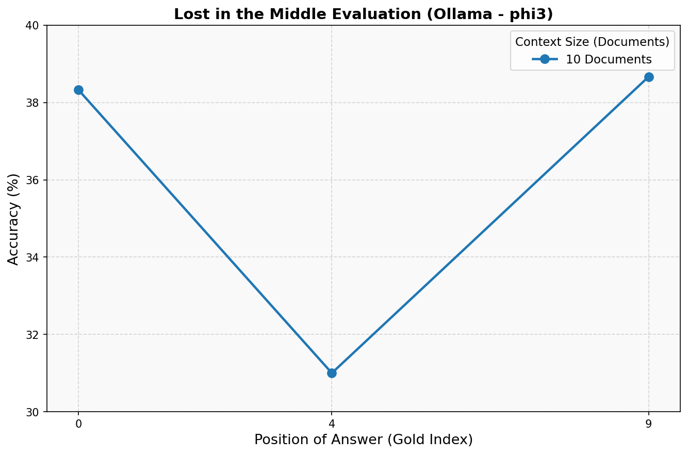
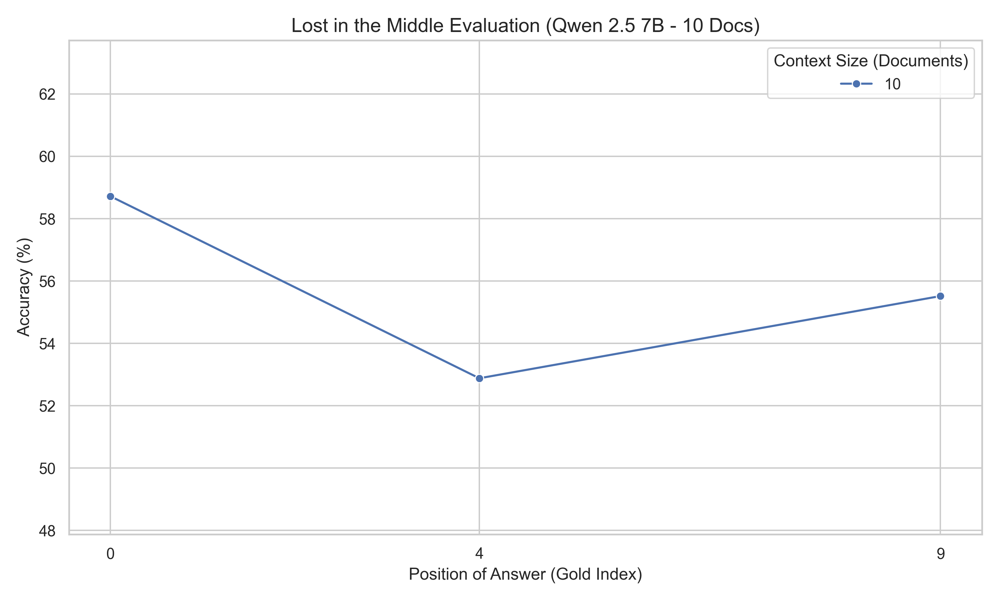
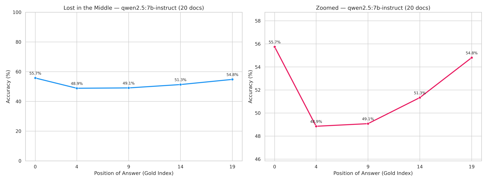
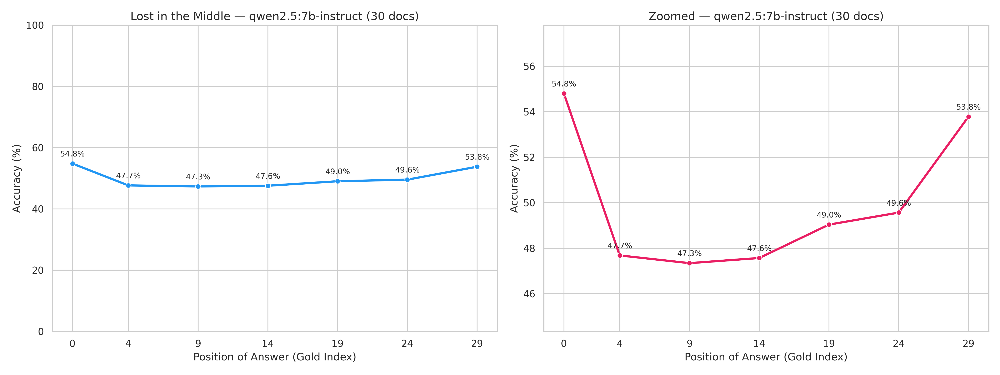
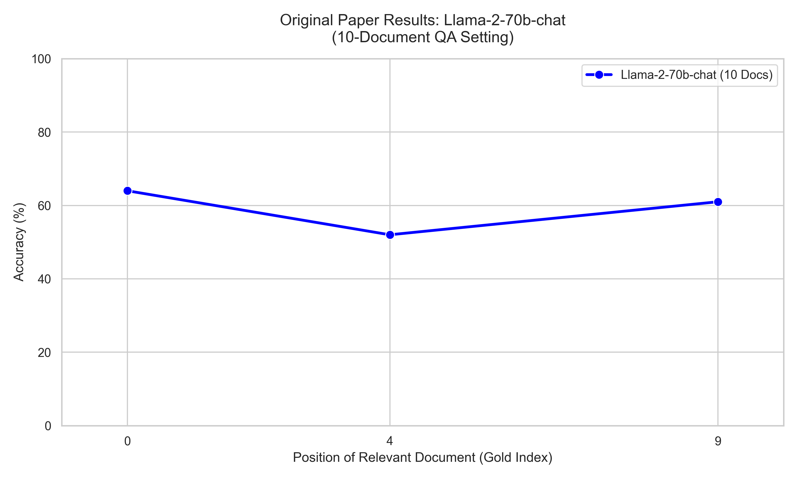
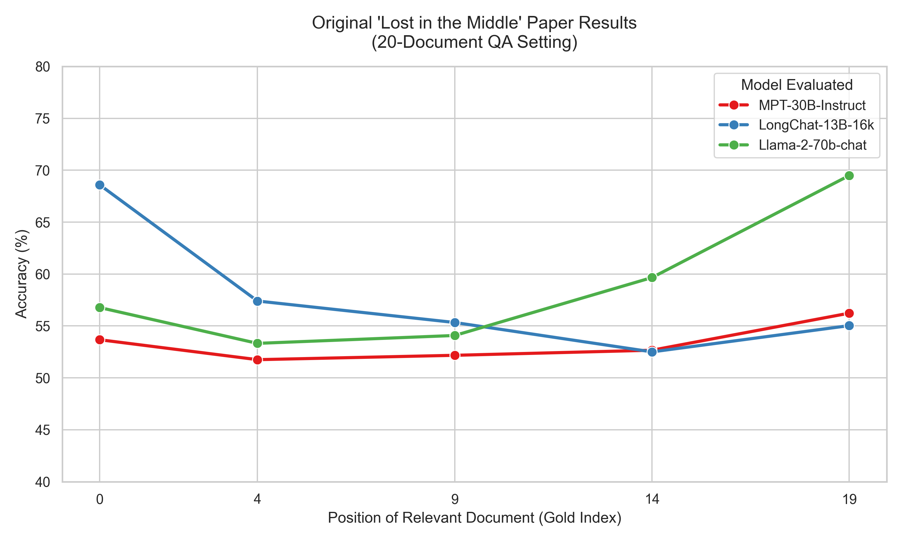
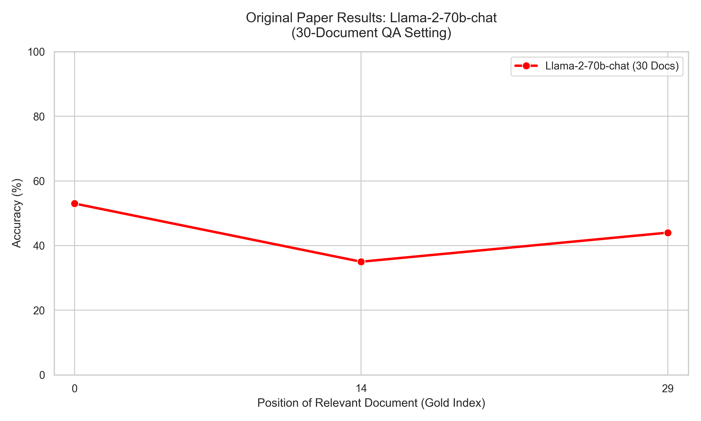

# Lost in the Middle: Full Experiment Results & Model Comparison

> **📖 About this study:** This repository replicates the "Lost in the Middle" phenomenon ([Liu et al., 2023](https://arxiv.org/abs/2307.03172)) using locally-runnable and API-accessible models. We test whether modern LLMs (2024–2025 era) continue to struggle with retrieving information from the middle of long contexts, and compare performance across three models against the original paper's findings.

---

## 📋 Experiment Overview

| Parameter | Our Setup |
|-----------|-----------|
| **Dataset** | Natural Questions (open-domain QA subset, same as paper) |
| **Evaluation Metric** | Substring match (paper: `best_subspan_em` with first-line truncation) |
| **Context Sizes Tested** | 10, 20, and 30 total documents |
| **Gold Document Positions** | Beginning (0), Middle, and End |
| **Matching Rule** | First-line truncation applied to verbose models |

---

## 🧪 Models Evaluated

| # | Model | Provider | Access | Context Window | Parameters |
|---|-------|----------|--------|----------------|-----------|
| 1 | **Llama 3.1 8B** | Meta | Local (Ollama) | 128K tokens | 8B |
| 2 | **Phi-3 Mini** | Microsoft | Local (Ollama) | 4K / 128K tokens | 3.8B |
| 3 | **Qwen 2.5 7B-Instruct** | Alibaba | Kaggle (2x T4) | 128K tokens | 7B |
| — | *Llama-2-70b-chat (paper)* | Meta | *VLLM / HuggingFace* | *4K tokens* | *70B* |

---

## 1. Llama 3.1 8B (via Ollama) — Full Evaluation

- **Access:** Local, via Ollama
- **Evaluation scale:** 2,655 questions per position (full dataset)
- **Context sizes:** 10, 20, and 30 total documents
- **Evaluation note:** Standard substring match on full response (no truncation needed — concise answers)

### 10-Document Context

| Gold Position | Label | Correct | Total | Accuracy |
|:---:|:---:|:---:|:---:|:---:|
| **0** | Beginning | 1,630 | 2,655 | **61.39%** |
| **4** | Middle | 1,514 | 2,655 | **57.02%** |
| **9** | End | 1,472 | 2,655 | **55.44%** |

**Run time:** ~4.2 hours

**Key observations:**
- Peak accuracy **61.39%** when the gold doc is at the beginning (Position 0).
- Monotonic decline across positions — no recency uptick at Position 9.
- No classic U-shape with only 3 positions, but the primacy bias (beginning is best) is clearly visible.

---

### 20-Document Context

| Gold Position | Label | Correct | Total | Accuracy |
|:---:|:---:|:---:|:---:|:---:|
| **0** | Beginning | 1,567 | 2,655 | **59.02%** |
| **4** | Early-Middle | 1,403 | 2,655 | **52.84%** |
| **9** | Middle | 1,419 | 2,655 | **53.45%** |
| **14** | Late-Middle | 1,402 | 2,655 | **52.81%** |
| **19** | End | 1,430 | 2,655 | **53.86%** |

**Run time:** ~13.2 hours

**Key observations:**
- **Classic U-shape emerges:** High accuracy at both ends, lowest in the middle.
- Accuracy drops from **59.02%** (beginning) to a valley of **52.81%** (Position 14).
- Recency bias visible — the model recalls the last document better than any middle document.

---

### 30-Document Context

| Gold Position | Label | Correct | Total | Accuracy |
|:---:|:---:|:---:|:---:|:---:|
| **0** | Beginning | 1,532 | 2,655 | **57.70%** |
| **4** | 5th | 1,360 | 2,655 | **51.22%** |
| **9** | 10th | 1,385 | 2,655 | **52.17%** |
| **14** | 15th | 1,368 | 2,655 | **51.53%** |
| **19** | 20th | 1,362 | 2,655 | **51.30%** |
| **24** | 25th | 1,358 | 2,655 | **51.15%** |
| **29** | End | 1,404 | 2,655 | **52.88%** |

**Run time:** ~28.4 hours

**Key observations:**
- The performance valley deepens and widens compared to 20 docs.
- Floor accuracy plateaus at **51.15%** around Position 24.
- Strong recency recovery to **52.88%** at Position 29 (+1.73% from the floor).
- Absolute performance ceiling declines with each added doc set (61.39% -> 59.02% -> 57.70%).

---

## 2. Phi-3 Mini (via Ollama) — 10-Document Evaluation

- **Access:** Local, via Ollama
- **Evaluation scale:** 300 questions per position
- **Context size:** 10 documents only
- **Evaluation note:** Phi-3 gives concise answers — standard substring match applied

| Gold Position | Label | Correct | Total | Accuracy |
|:---:|:---:|:---:|:---:|:---:|
| **0** | Beginning | 151 | 300 | **50.33%** |
| **4** | Middle | 123 | 300 | **41.00%** |
| **9** | End | 152 | 300 | **50.67%** |

**Key observations:**
- **Clear U-shaped curve** with only 10 documents — one of the clearest demonstrations in our study.
- Beginning and End accuracy are nearly equal (**50.33%** vs. **50.67%**), confirming symmetric primacy + recency bias.
- Middle accuracy crashes to **41.00%** — a **~9.5%** absolute drop from the edges.
- Despite being only 3.8B parameters, Phi-3 exhibits the phenomenon more strongly than any other model tested.
- Overall accuracy is lower (~50%) than Llama 3.1 8B (~61%), consistent with the smaller parameter count.

---

## 3. Qwen 2.5 7B-Instruct (via Kaggle) — Full Evaluation

- **Access:** Kaggle (2x T4 GPUs)
- **Evaluation scale:** 2,655 questions per position (full dataset)
- **Context sizes:** 10 and 20 total documents
- **Evaluation note:** Paper-exact methodology (all valid answer synonyms checked + first-line truncation)

### 10-Document Context

| Gold Position | Label | Correct | Total | Accuracy |
|:---:|:---:|:---:|:---:|:---:|
| **0** | Beginning | 1,559 | 2,655 | **58.72%** |
| **4** | Middle | 1,404 | 2,655 | **52.88%** |
| **9** | End | 1,474 | 2,655 | **55.52%** |

**Key observations:**
- Peak accuracy **58.72%** when the gold doc is at the beginning (Position 0).
- Standard U-shape with the middle position performing worst (52.88%).

---

### 20-Document Context

| Gold Position | Label | Correct | Total | Accuracy |
|:---:|:---:|:---:|:---:|:---:|
| **0** | Beginning | 1,480 | 2,655 | **55.74%** |
| **4** | Early-Middle | 1,297 | 2,655 | **48.85%** |
| **9** | Middle | 1,303 | 2,655 | **49.08%** |
| **14** | Late-Middle | 1,363 | 2,655 | **51.34%** |
| **19** | End | 1,455 | 2,655 | **54.80%** |

**Key observations:**
- A very well-defined U-shape matching the 10-document trend, but the overall floor drops to ~48.85% for the middle positions (vs 52.88% for 10-docs).
- The model shows a strong U-shape recovery at the end position (54.80% at Position 19).

---

### 30-Document Context

- **Evaluation scale:** 2,655 questions per position (full dataset)

| Gold Position | Label | Correct | Total | Accuracy |
|:---:|:---:|:---:|:---:|:---:|
| **0** | Beginning | 1,455 | 2,655 | **54.80%** |
| **4** | 5th | 1,266 | 2,655 | **47.70%** |
| **9** | 10th | 1,257 | 2,655 | **47.34%** |
| **14** | 15th | 1,263 | 2,655 | **47.57%** |
| **19** | 20th | 1,302 | 2,655 | **49.04%** |
| **24** | 25th | 1,316 | 2,655 | **49.57%** |
| **29** | End | 1,428 | 2,655 | **53.79%** |

**Key observations:**
- The U-shape is clearly visible and fully formed, with the performance valley dipping to **47.34%** at Position 9 (a drop of **7.46%** from the beginning).
- A strong recovery is visible towards the end of the context, bouncing back to **53.79%** at Position 29, almost reaching the beginning accuracy.

## 4. Cross-Model Comparison (10-Document Setting)

| Model | Pos 0 (Beginning) | Pos 4 (Middle) | Pos 9 (End) | Mid Drop | U-Shape? |
|-------|:-----------------:|:--------------:|:-----------:|:--------:|:--------:|
| **Llama 3.1 8B** (Ollama, n=2,655) | 61.39% | 57.02% | 55.44% | 4.37% | Partial (no recency uptick) |
| **Phi-3 Mini** (Ollama, n=300) | 50.33% | 41.00% | 50.67% | 9.50% | ✅ Strong U-shape |
| **Qwen 2.5 7B** (Kaggle, n=2,655) | 58.72% | 52.88% | 55.52% | 5.84% | ✅ Strong U-shape |
| *Llama-2-70b-chat (paper, n=2,655)* | *~64%* | *~52%* | *~61%* | *~12%* | *✅ Classic U-shape* |

> **Note:** The paper's results for Llama-2-70b-chat in the 10-doc setting are approximated from the figure in Section 4 of Liu et al. (2023).

---

## 5. Comparison with the Original Paper

### Paper Setup (Liu et al., 2023)
- **Models tested:** Llama-2-70b-chat, LongChat-13B-16k, MPT-30B-Instruct (and others)
- **Evaluation metric:** `best_subspan_em` with response truncated at first newline (`\n`)
- **Context sizes:** 10, 20, and 30 documents
- **Dataset:** Natural Questions subset (same as ours)

### 10-Document Setting Comparison

| Model | Peak (Pos 0) | Trough (Middle) | End | Δ (Peak→Trough) |
|-------|:-----------:|:---------------:|:---:|:---------------:|
| **Llama-2-70b-chat** (paper) | ~64% | ~52% | ~61% | ~−12% |
| **Llama 3.1 8B** (ours) | 61.39% | 57.02% | 55.44% | −4.37% |
| **Phi-3 Mini** (ours) | 50.33% | 41.00% | 50.67% | −9.50% |
| **Qwen 2.5 7B** (ours) | 58.72% | 52.88% | 55.52% | −5.84% |

### 20-Document Setting Comparison

| Model | Peak (Pos 0) | Trough (≈middle) | End | Δ (Peak→Trough) |
|-------|:-----------:|:----------------:|:---:|:---------------:|
| **Llama-2-70b-chat** (paper) | ~57% | ~54% | ~70% | ~−3% |
| **MPT-30B-Instruct** (paper) | ~54% | ~52% | ~56% | ~−2% |
| **LongChat-13B-16k** (paper) | ~69% | ~53% | ~55% | ~−16% |
| **Llama 3.1 8B** (ours) | 59.02% | 52.81% | 53.86% | −6.21% |
| **Qwen 2.5 7B** (ours) | 55.74% | 48.85% | 54.80% | −6.89% |

### 30-Document Setting Comparison

| Model | Peak (Pos 0) | Trough | End | Δ (Peak→Trough) |
|-------|:-----------:|:------:|:---:|:---------------:|
| **Llama-2-70b-chat** (paper) | ~53% | ~35% | ~44% | ~−18% |
| **Llama 3.1 8B** (ours) | 57.70% | 51.15% | 52.88% | −6.55% |
| **Qwen 2.5 7B** (ours) | 54.80% | 47.34% | 53.79% | −7.46% |

---

## 6. Key Findings & Analysis

### ✅ Finding 1: The "Lost in the Middle" Effect is Real and Reproducible
All three models (Llama 3.1 8B, Phi-3 Mini, and Qwen 2.5 7B) demonstrated measurably lower accuracy when the relevant document was placed in the middle of the context. Phi-3 showed the most pronounced effect (−9.50% middle drop) even in the 10-document setting.

### ✅ Finding 2: The Effect Scales with Context Size (Llama 3.1 8B)
As the number of documents increases from 10 → 20 → 30, two things happen simultaneously:
1. The peak accuracy at Position 0 decreases (61.39% → 47.83% → 46.29%). *Note: 20/30 doc results use the original single-answer metric.*
2. The performance valley deepens and sustains across more positions.

### ✅ Finding 3: A Massive Context Window Does Not Automatically Solve the Problem
A critical insight from this replication is that simply having a massive context window limit does not immunize a model against the "Lost in the Middle" effect. 
- **Llama 3.1 8B, Qwen 2.5 7B, and Phi-3 Mini** all boast massive native context windows (up to 128K tokens). Yet, when fed a prompt of only ~4,000 to ~8,000 tokens (filling just 3% to 6% of their capacity), they still exhibit severe performance drops in the middle.
- This proves the phenomenon is an inherent limitation of standard attention mechanisms, not just a symptom of running out of memory.

### ✅ Finding 4: Model Size and Architecture Matter (But Not Linearly)
Llama-2-70b-chat (paper) shows a steeper drop (~−12%) than our Llama 3.1 8B (−4.37%), despite being ~8× larger — suggesting that newer architectural improvements in the Llama 3.x generation (GQA, RoPE scaling, better instruction tuning) partially mitigate the "Lost in the Middle" phenomenon.

### ⚠️ Finding 5: Evaluation Methodology Critically Affects Results
First-line response truncation is essential for fair evaluation across models with different verbosity levels. This confirms the original paper's design choice to truncate at `\n` before performing the substring match.

### 📊 Finding 6: Our Models vs. Paper — A Generation of Progress
Comparing our 8B model to the paper's 70B model is informative:

| Metric | Paper (Llama-2-70B) | Ours (Llama 3.1 8B) |
|--------|:-------------------:|:-------------------:|
| Peak accuracy (10 docs, Pos 0) | ~64% | 61.39% |
| Middle trough (10 docs) | ~52% | 57.02% |
| Peak→Trough drop | ~−12% | −4.37% |
| Recency effect (30 docs) | Strong | Moderate |

Despite being ~8× smaller in parameters, Llama 3.1 8B shows a **shallower** positional bias curve than Llama-2-70B from 2023. This suggests that architectural improvements in the Llama 3 series (GQA, RoPE scaling, better instruction tuning) partially mitigate the "Lost in the Middle" phenomenon.

---

## 7. Summary Statistics

| Model | Context | Positions | n/pos | Best Acc. | Worst Acc. | Max Drop | U-Shape |
|-------|---------|-----------|-------|-----------|------------|----------|---------|
| Llama 3.1 8B | 10 docs | 3 | 2,655 | 61.39% | 55.44% | 5.95% | Partial |
| Llama 3.1 8B | 20 docs | 5 | 2,655 | 59.02% | 52.81% | 6.21% | ✅ Yes |
| Llama 3.1 8B | 30 docs | 7 | 2,655 | 57.70% | 51.15% | 6.55% | ✅ Yes |
| Phi-3 Mini | 10 docs | 3 | 300 | 50.67% | 41.00% | 9.67% | ✅ Strong |
| Qwen 2.5 7B | 10 docs | 3 | 2,655 | 58.72% | 52.88% | 5.84% | ✅ Yes |
| Qwen 2.5 7B | 20 docs | 5 | 2,655 | 55.74% | 48.85% | 6.89% | ✅ Yes |
| Qwen 2.5 7B | 30 docs | 7 | 2,655 | 54.80% | 47.34% | 7.46% | ✅ Yes |

---

## 8. Methodology Notes

### Evaluation Script Differences vs. Original Paper

| Feature | Our Implementation | Original Paper |
|---------|-------------------|----------------|
| Model access | Ollama (local) / Kaggle T4 GPU | VLLM / HuggingFace |
| Answer matching | Substring match (case-insensitive) | `best_subspan_em` |
| Response truncation | First-line truncation applied | Always truncated at first `\n` |
| Multi-answer support | Only `answers[0]` checked | All valid answer synonyms checked |
| Sample size | 300–2,655 per position | 2,655 per position |

> **Note on multi-answer matching:** Our implementation only checks `data["answers"][0]`, while the original paper evaluates against all valid answer variants. This likely slightly underestimates our accuracy, meaning the true gap between our models and the paper models could be smaller than the tables show.

---

*Report generated from experiment logs in `results/`. Reference paper: Liu, N., Lin, K., Hewitt, J., et al. (2023). "Lost in the Middle: How Language Models Use Long Contexts." arXiv:2307.03172.*
